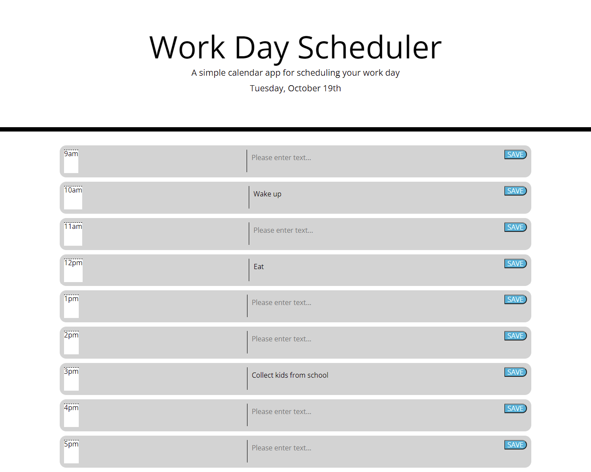
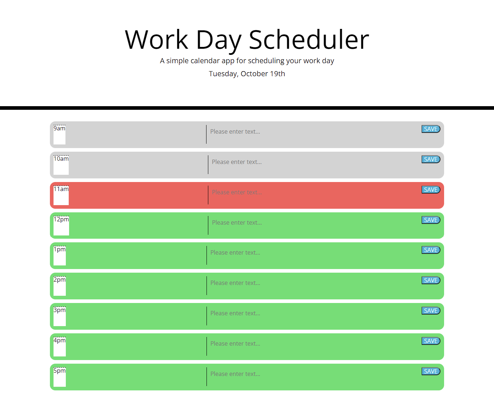
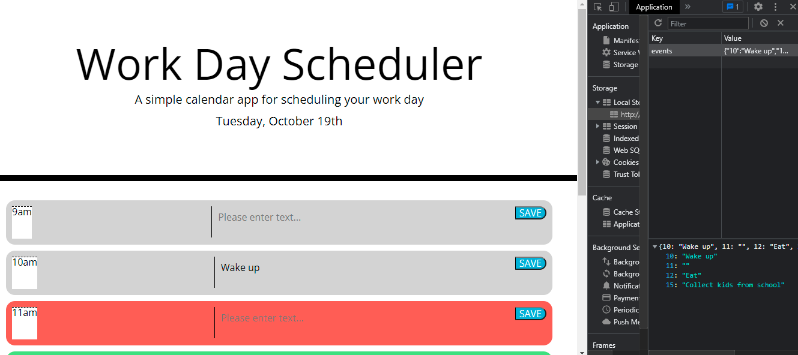
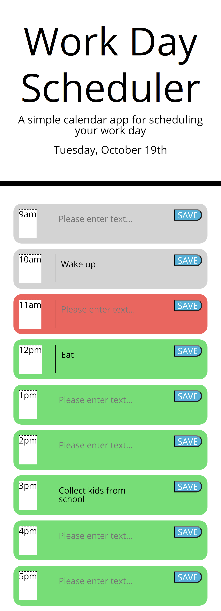

#WORK DAY SCHEDULER(COMPLETE)

## PROJECT DESCRIPTION

Objective was to create a current day schedule that the user could input events and see which events
were in the past present and future and save events to local storage

## LINK TO WORKING PAGE

Click [here](https://lenny-g.github.io/work-day-schedule/) for finished webpage

## SCREENSHOTS

This is a screenshot of the current webpage at 23:35pm

This is a screenshot of the webpage when the current time is altered to 12am

This is a screenshot of the local storage with input

This is a screenshot of the webpage's functionality on a mobile device

## WORK ACHIEVED :

- Created a schedule for the current date.
- Created classes for past, present and future and color coded them
- Created a local storage to save input
